# Principal Components Analysis and Singular Value Decomposition

## Matrix data
``` r
set.seed(12345)
par(mar=rep(0.2, 4))
dataMatrix <- matrix(rnorm(400), nrow=40)
image(1:10, 1:40, t(dataMatrix)[, nrow(dataMatrix):1])
```
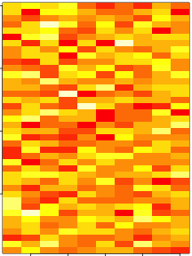
``` r
par(mar=rep(0.2, 4))
heatmap(dataMatrix)
```
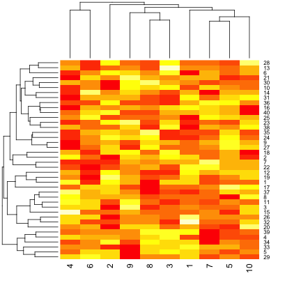

## What if we add a pattern?
``` r
set.seed(678910)
for (i in 1:40) {
    # flip a coin
    coinFlip <- rbinom(1, size=1, prob=0.5)
    # if coin is heads, add a common pattern to that row
    if (coinFlip) {
        dataMatrix[i,] <- dataMatrix[i,] + rep(c(0, 3), each=5)
    }
}
```
## What if we add a pattern? - the data
``` r
par(mar=rep(0.2, 4))
image(1:10, 1:40, t(dataMatrix)[,nrow(dataMatrix):1])
```
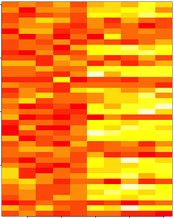

## What if we add a pattern? - the clustered data
``` r
par(mar=rep(0.2, 4))
heatmap(dataMatrix)
```
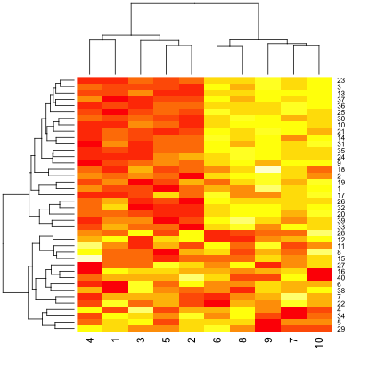

## Patterns in rows and columns
``` r
hh <- hclust(dist(dataMatrix))
dataMatrixOrdered <- dataMatrix[hh$order,]
par(mfrow=c(1, 3))
image(t(dataMatrixOrdered)[,nrow(dataMatrixOrdered):1])
plot(rowMeans(dataMatrixOrdered), 40:1, , xlab="Row Mean", ylab="Row", pch=19)
plot(colMeans(dataMatrixOrdered), xlab="Column", ylab="Column Mean", pch=19)
```
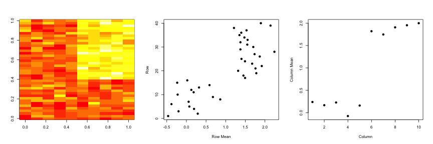

## Related problems
##### You have multivariate variables _X_<sub>1</sub>,...,_X_<sub>n</sub> so _X_<sub>1</sub> = (_X_<sub>11</sub>,...,_X_<sub>1<em>m</em></sub>)
- Find a new set of multivariate variables that are uncorrelated and explain as much variance as possible.
- If you put all the variables together in one matrix, find the best matrix created with fewer variables (lower rank) that explains the original data.

The first goal is **statistical** and the second goal is **data compression**.

## Related solutions - PCS/SVD

###### SVD
If _**X**_ is a matrix with each variable in a column and each observation in a row then SVD is a "matrix decomposition"
>_X = UDV_<sup><em>T</em></sup>

where the columns of _**U**_ are orthogonal (left singular vectors), the columns of _**V**_ are orthogonal (right singular vectors) and _**D**_ is a diagonal matrix (singular values).

###### PCA
The principal components are equal to the right singular values if you first scale (subtract the mean, divide by the standard deviation) the variables.

## Components of the SVC - _u_ and _v_
``` r
svd1 <- svd(scale(dataMatrixOrdered))
par(mfrow=c(1, 3))
image(t(dataMatrixOrdered)[,nrow(dataMatrixOrdered):1])
plot(svd1$u[,1], 40:1, , xlab="Row", ylab="First left singular vector", pch=19)
plot(svd1$v[,1], xlab="Column", ylab="First right singular vector", pch=19)
```
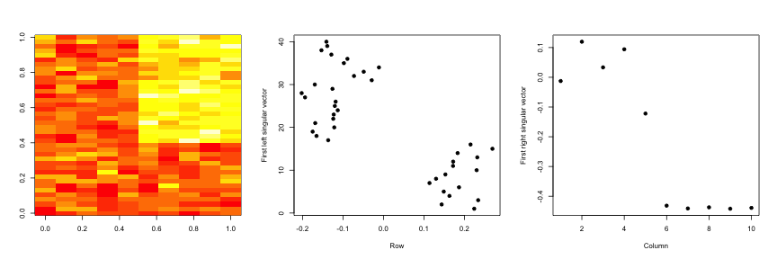

## Components of the SVD - Variance explained
``` r
par(mfrow=c(1, 2))
plot(svd1$d, xlab="Column", ylab="Singular value", pch=19)
plot(svd1$d^2/sum(svd1$d^2), xlab="Column", ylab="Prop. of variance explained",
     pch=19)
```
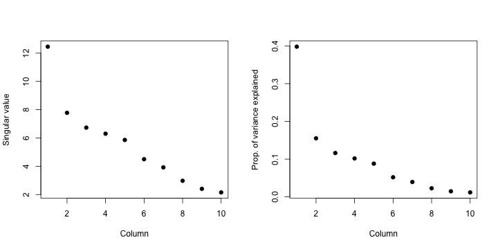

## Relationship to principal components
``` r
svd1 <- svd(scale(dataMatrixOrdered))
pca1 <- prcomp(dataMatrixOrdered, scale=T)
plot(pca1$rotation[,1], svd1$v[,1], pch=19, xlab="Principal Component 1",
     ylab="Right Singular Vector 1")
abline(c(0, 1))
```
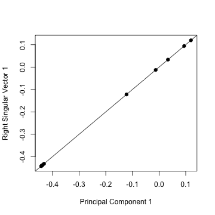

## Components of the SVD - variance explained
``` r
constantMatrix <- dataMatrixOrdered*0
for (i in 1:dim(dataMatrixOrdered)[1]) {
    constantMatrix[i,] <- rep(c(0, 1), each=5)
}
svd1 <- svd(constantMatrix)
par(mfrow=c(1, 3))
image(t(constantMatrix)[,nrow(constantMatrix):1])
plot(svd1$d, xlab="Column", ylab="Singular value", pch=19)
plot(svd1$d^2/sum(svd1$d^2), xlab="Column", ylab="Prop. of variance explained",
     pch=19)
```


## What if we add a second pattern?
``` r
set.seed(678910)
for (i in 1:40) {
    # flip a coin
    coinFlip1 <- rbinom(1, size=1, prob=0.5)
    coinFlip2 <- rbinom(1, size=1, prob=0.5)
    # if coin is heads, add a common pattern to that row
    if (coinFlip1) {
        dataMatrix[i,] <- dataMatrix[i,] + rep(c(0, 5), each=5)
    }
    if (coinFlip2) {
        dataMatrix[i,] <- dataMatrix[i,] + rep(c(0, 5), 5)
    }
}
hh <- hclust(dist(dataMatrix))
dataMatrixOrdered <- dataMatrix[hh$order,]
```

## Singular value decomposition - true patterns
``` r
svd2 <- svd(scale(dataMatrixOrdered))
par(mfrow=c(1, 3))
image(t(dataMatrixOrdered)[,nrow(dataMatrixOrdered):1])
plot(rep(c(0, 1), each=5), pch=19, xlab="Column", ylab="Pattern 1")
plot(rep(c(0, 1), 5), pch=19, xlab="Column", ylab="Pattern 2")
```
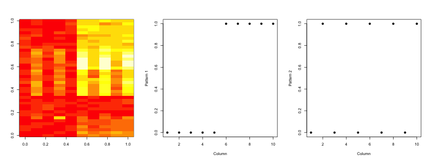

## _v_ and patterns of variance in rows
``` r
svd2 <- svd(scale(dataMatrixOrdered))
par(mfrow=c(1, 3))
image(t(dataMatrixOrdered)[,nrow(dataMatrixOrdered):1])
plot(svd2$v[,1], pch=19, xlab="Column", ylab="First right singular vector")
plot(svd2$v[,2], pch=19, xlab="Column", ylab="Second right singular vector")
```


## _d_ and variance explained
``` r
svd1 <- svd(scale(dataMatrixOrdered))
par(mfrow=c(1, 2))
plot(svd1$d, xlab="Column", ylab="Singular value", pch=19)
plot(svd1$d^2/sum(svd1$d^2), xlab="Column",
     ylab="Percent of variance explained", pch=19)
```


## Missing values
``` r
dataMatrix2 <- dataMatrixOrdered
## Randomly insert some missing data
dataMatrix2[sample(1:100, size=40, replace=F)] <- NA
svd1 <- svd(scale(dataMatrix2)) ## Doesn't work!
```
``` r
Error in svd(scale(dataMatrix2)) : infinite or missing values in 'x'
```

## Imputing with `impute`
``` r
library(impute) ## Available from http://bioconductor.org
dataMatrix2 <- dataMatrixOrdered
dataMatrix2[sample(1:100, size=40, replace=F)] <- NA
dataMatrix2 <- impute.knn(dataMatrix2)$data
svd1 <- svd(scale(dataMatrixOrdered))
svd2 <- svd(scale(dataMatrix2))
par(mfrow=c(1, 2))
plot(svd1$v[,1], pch=19)
plot(svd2$v[,1], pch=19)
```
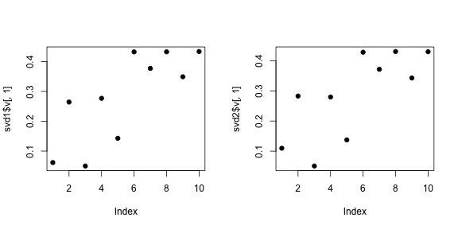

## Face example
``` r
load("data/face.rda") # ???
image(t(faceData)[,nrow(faceData):1])
```
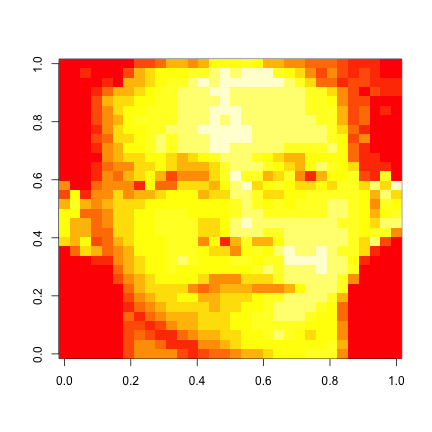

## Face example - variance explained
``` r
svd1 <- svd(scale(faceData))
plot(svd1$d^2/sum(svd1$d^2), pch=19, xlab="Singular vector",
     ylab="Variance explained")
```
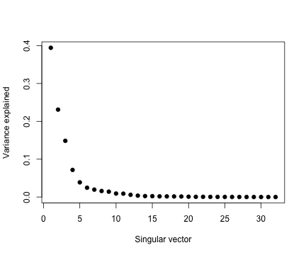

## Face example - create approximations
``` r
svd1 <- svd(scale(faceData))

## Note that %*% is matrix multiplication
# Here svd1$d[1] is a constant
approx1 <- svd1%u[,1] %*% t(svd1$v[,1]) * svd1$d[1]

# In these examples we need to make the diagonal matrix out of d
approx5 <- svd1$u[,1:5] %*% diag(svd1$d[1:5]) %*% t(svd1$v[,1:5])
approx10 <- svd1$u[,1:10] %*% diag(svd1$d[1:10]) %*% t(svd1$v[,1:10])
```

## Face example - plot approximations
``` r
par(mfrow=c(1, 4))
image(t(approx1)[,nrow(approx1):1], main="(a)")
image(t(approx5)[,nrow(approx5):1], main="(b)")
image(t(approx10)[,nrow(approx10):1], main="(c)")
image(t(faceData)[,nrow(faceData):1], main="(d)")
```
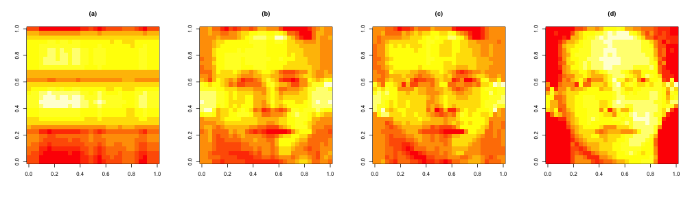

## Notes and further resources
- Scale matters
- PC's/SV's may mix real patterns
- Can be computationally intensive
- [Advanced data analysis from an elementary point of view](http://www.stat.cmu.edu/~cshalizi/ADAfaEPoV/ADAfaEPoV.pdf)