# Hierarchical Clustering
## Can we find things that are close together?
##### Clustering organizes things that are **close** into groups
- How do we define close?
- How do we group things?
- How do we visualize the grouping?
- How do we interpret the grouping?

## Hugely important/impactful
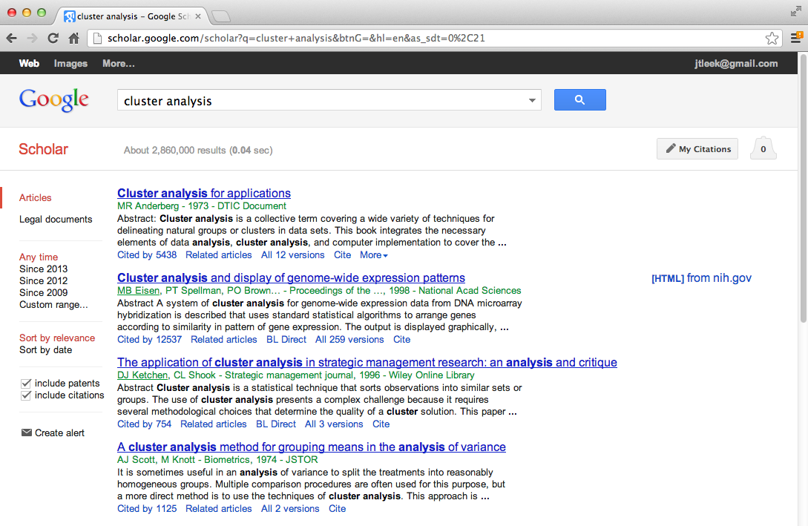
##### [https://scholar.google.com/scholar?hl=en&q=cluster+analysis&btnG=&as_sdt=1%2C21&as_sdtp=](https://scholar.google.com/scholar?hl=en&q=cluster+analysis&btnG=&as_sdt=1%2C21&as_sdtp=)

## Hierarchical clustering
- An agglomerative approach
	- Find closest two things
	- Put them together
	- Find next closest
- Requires
	- A defined distance
	- A merging approach
- Produces
	- A tree showing how close things are to each other

## How do we define close?
- Most important step
	- Garbage in -> garbage out
- Distance or similarity
	- Continuous - euclidean distance
	- Continuous - correlation similarity
	- Binary - Manhattan distance
- Pick a distance/similarity that makes sense for your problem

## Example distances - Euclidean
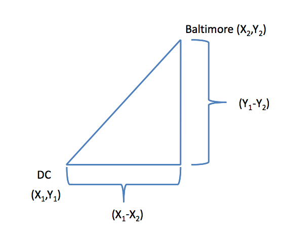
##### [http://rafalab.jhsph.edu/688/lec/lecture5-clustering.pdf](http://rafalab.jhsph.edu/688/lec/lecture5-clustering.pdf)
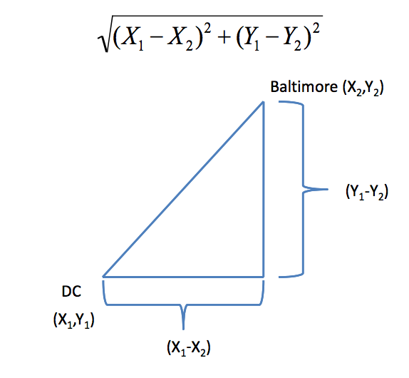
##### To expand to multiple dimensions:

##### [http://rafalab.jhsph.edu/688/lec/lecture5-clustering.pdf](http://rafalab.jhsph.edu/688/lec/lecture5-clustering.pdf)

## Example distances - Manhattan
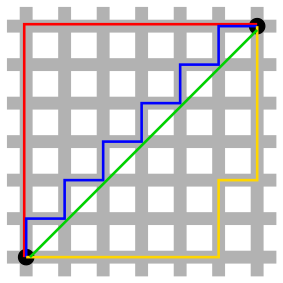
##### In general:

##### http://en.wikipedia.org/wiki/Taxicab_geometry

## Hierarchical clustering - example

``` r
set.seed(1234)
par(mar=c(0, 0, 0, 0))
x <- rnorm(12, mean=rep(1:3, each=4), sd=0.2)
y <- rnorm(12, mean=rep(c(1, 2, 1), each=4), sd=0.2)
plot(x, y, col="blue", pch=19, cex=2)
text(x + 0.05, y + 0.05, labels=as.character(1:12))
```

##### There are three obvious clusters, but can we investigate this mathematically?

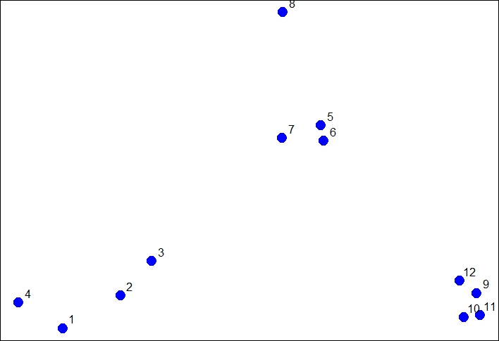

## Hierarchical clustering - Using `dist` to create clusters w/ `hclust`
- Important parameters: _x_, _method_

``` r
dataFrame <- data.frame(x=x, y=y)
dist(dataFrame)
```
##### Returns a lower triangular matrix w/ all pairwise distances.
``` r
            1          2          3          4          5          6          7
2  0.34120511                                                                  
3  0.57493739 0.24102750                                                       
4  0.26381786 0.52578819 0.71861759                                            
5  1.69424700 1.35818182 1.11952883 1.80666768                                 
6  1.65812902 1.31960442 1.08338841 1.78081321 0.08150268                      
7  1.49823399 1.16620981 0.92568723 1.60131659 0.21110433 0.21666557           
8  1.99149025 1.69093111 1.45648906 2.02849490 0.61704200 0.69791931 0.65062566
9  2.13629539 1.83167669 1.67835968 2.35675598 1.18349654 1.11500116 1.28582631
10 2.06419586 1.76999236 1.63109790 2.29239480 1.23847877 1.16550201 1.32063059
11 2.14702468 1.85183204 1.71074417 2.37461984 1.28153948 1.21077373 1.37369662
12 2.05664233 1.74662555 1.58658782 2.27232243 1.07700974 1.00777231 1.17740375
            8          9         10         11
2                                             
3                                             
4                                             
5                                             
6                                             
7                                             
8                                             
9  1.76460709                                 
10 1.83517785 0.14090406                      
11 1.86999431 0.11624471 0.08317570           
12 1.66223814 0.10848966 0.19128645 0.20802789
```

## Hierarchical clustering - #1 - What are the two closest pairs?
##### Ans: 5 & 6 (yellow). 
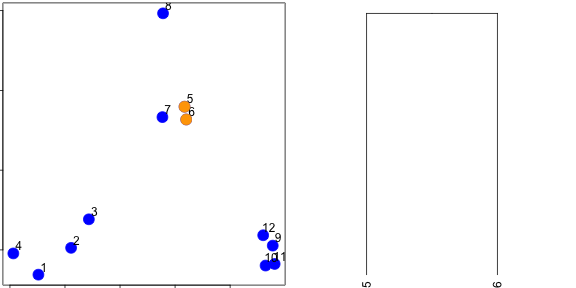

## Hierarchical clustering - #2 - Consider 5 & 6 one point for all future steps.
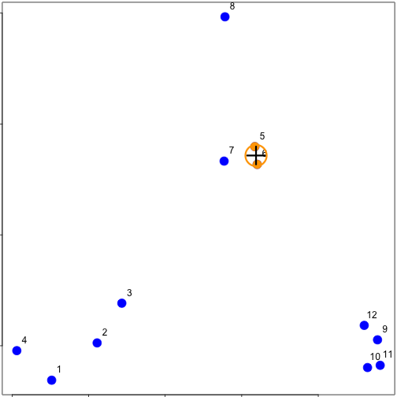

## Hierarchical clustering - #3 - What are the next two closest pairs?
##### Ans: 10 & 11 (red).
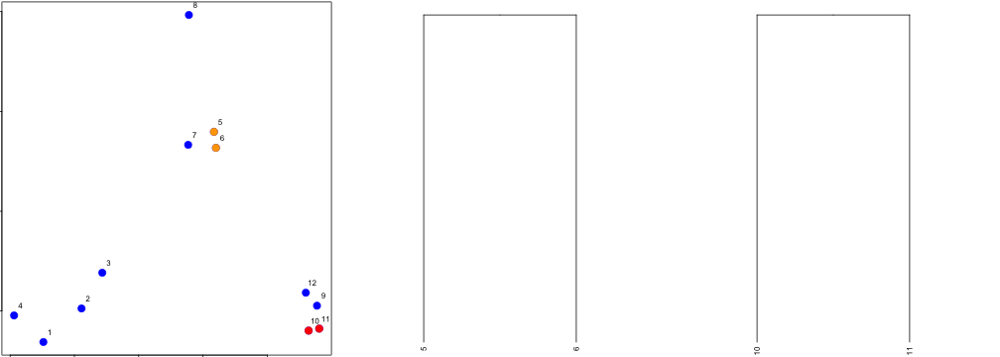

##### Etc. Eventually you get a dendrogram. This is how `hclust` works.

## Hierarchical clustering - `hclust`

``` r
dataFrame <- data.frame(x=x, y=y)
distxy <- dist(dataFrame)
hClustering <- hclust(distxy)
plot(hClustering)
```

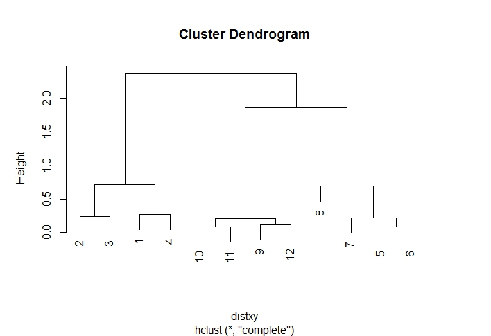

##### Notice that it doesn't tell you how many clusters their are. It's a tool to allow you to pick where you want to cut the clusters (based on the Y "Height" axis).

##### Is Y the distance between two points?

## Prettier dendrograms

``` r
myplclust <- function(hclust, lab=hclust$labels,
                      lab.col=rep(1, length(hclust$labels)),
                      hang=0.1, ...) {
    # modification of plclust for plotting hclust objects *in color*!
    # Copyright Eva FK Chan 2009
    # Arguments: 
    #   hclust: hclust object
    #   lab: a character vector of labels of the leaves of the tree
    #   lab.col: color for the labels; NA = default device foreground color
    #   hang: as in hclust & plclust
    #   ...: other plot parameters
    y <- rep(hclust$height, 2)
    x <- as.numeric(hclust$merge)
    y <- y[which(x < 0)]
    x <- x[which(x < 0)]
    x <- abs(x)
    y <- y[order(x)]
    x <- x[order(x)]
    plot(hclust, labels=F, hang=hang, ...)
    text(x=x, y=y[hclust$order] - (max(hclust$height) * hang),
         labels=lab[hclust$order], col=lab.col[hclust$order],
         srt=90, adj=c(1, 0.5), xpd=NA, ...)
}
```
``` r
dataFrame <- data.frame(x=x, y=y)
distxy <- dist(dataFrame)
hClustering <- hclust(distxy)
myplclust(hClustering, lab=rep(1:3, each=4), lab.col=rep(1:3, each=4))
```

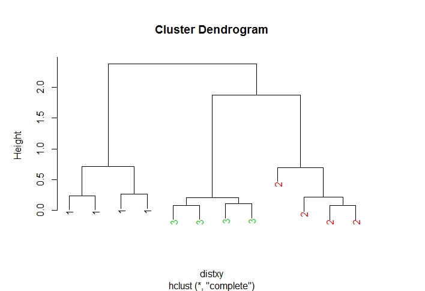

## Even prettier dendograms
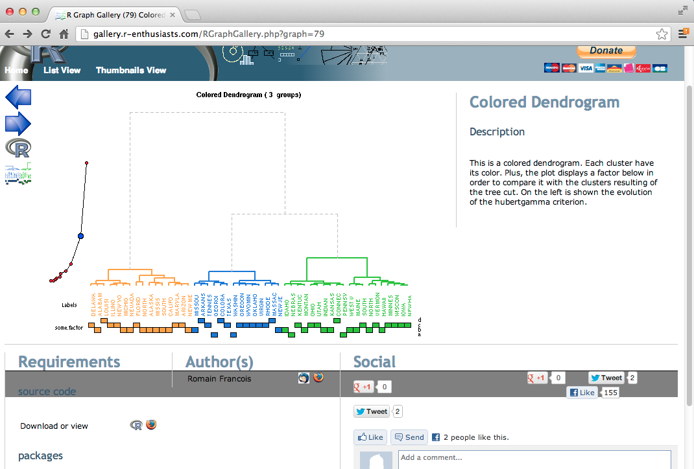
##### [http://gallery.r-enthusiasts.com/RGraphGallery.php?graph=79](http://gallery.r-enthusiasts.com/RGraphGallery.php?graph=79)

# In hierarchical clustering, how do you merge points together
## Merging points in hierarchical clustering - complete linkage
- Find the two points in a cluster that are farthest apart
- Compute the distance between them
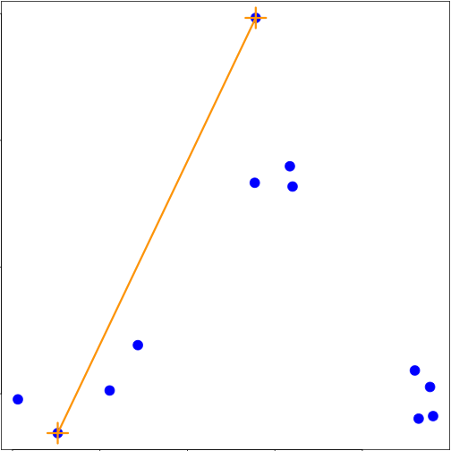

## Merging points - average linkgage
- Find the center of gravity between two clusters
- Compute the distance between them
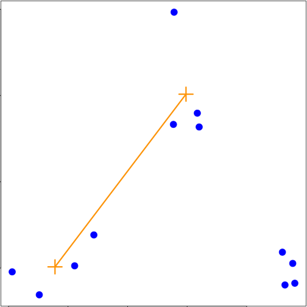

##### Try both to see what difference they make

## heatmap()
- Runs a hierarchical cluster anaysis on the rows and the columns separately
- Organizes the rows and columns according to the hierarhical clustering
``` r
dataFrame <- data.frame(x=x, y=y)
set.seed(143)
dataMatrix <- as.matrix(dataFrame)[sample(1:12),]
heatmap(dataMatrix)
```
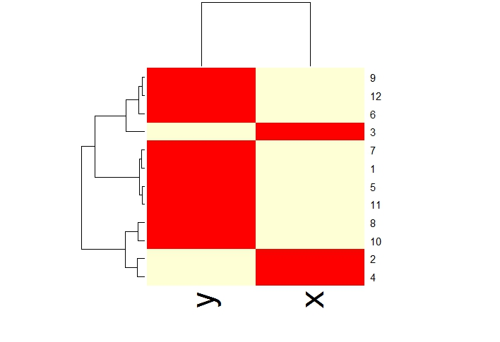

## Notes and further resources
- Gives an idea of the realtionships between variables/observations
- The picture may be unstable
	- Change a few points
	- Have different missing values
	- Pick a different distance
	- Change the merging strategy
	- Change the scale of points for one variable
- But it is deterministic
- Choosing where to cut isn't always obvious
- Should be primarily used for exploration
- [Rafa's Distances and Clustering Video](https://www.youtube.com/watch?v=wQhVWUcXM0A)
- [Elements of statistical learning](http://www-stat.stanford.edu/~tibs/ElemStatLearn/)