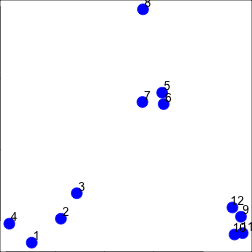
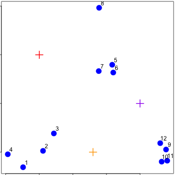
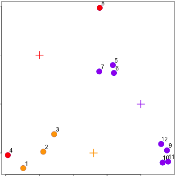
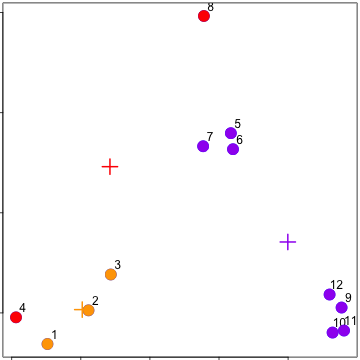
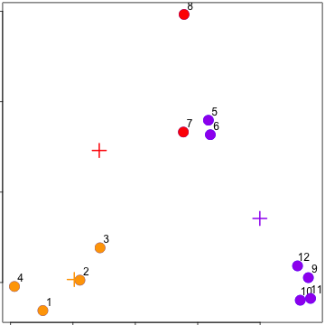
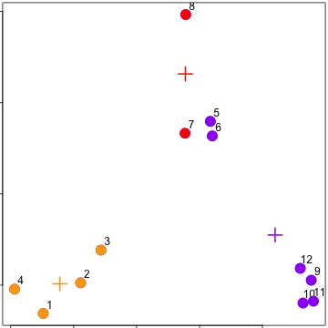
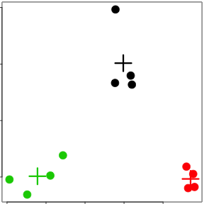
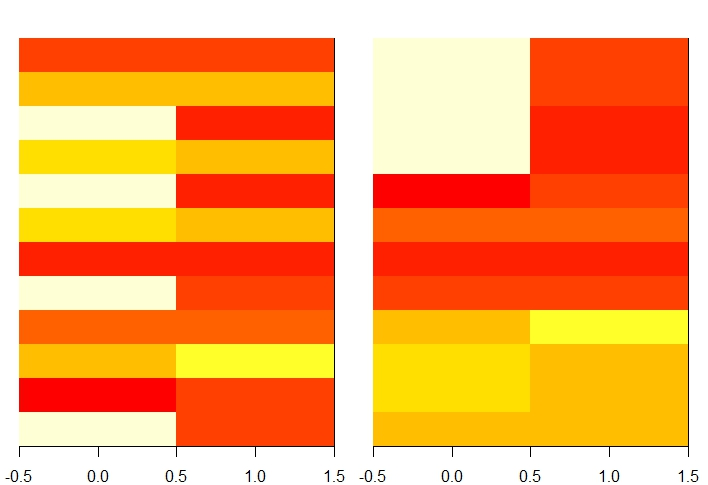

# K-Means Clustering
## Can we find things that are close together?
- How do we define close?
- How do we group things?
- How do we visualize the grouping?
- How do we interpret the grouping?

## How do we define close?
##### We need a distance metric.
- Most important step
	- Garbage in -> garbage out
- Distance or similarity
	- Continuous - euclidean distance
	- Continuous - correlation similarity
	- Binary - Manhattan distance
- Pick a distance/similarity that makes sense for your problem

## K-means clustering
- A partitioning approach
	- Determine a fixed number of clusters
	- Get "centroids" of each cluster
	- Assign things to closest centroid
	- Recalculate centroids
- Requires
	- A defined distance metric
	- A number of clusters
	- An initial guess as to cluster centroids
- Produces
	- Final estimate of cluster centroids
	- An assignment of each point to clusters

## K-means clustering - example
``` r
# Random 2-dimensional data
set.seed(1234)
par(mar=c(0, 0, 0, 0))
x <- rnorm(12, mean=rep(1:3, each=4), sd=0.2)
y <- rnorm(12, mean=rep(c(1, 2, 1), each=4), sd=0.2)
plot(x, y, col="blue", pch=19, cex=2)
text(x + 0.05, y + 0.05, labels=as.character(1:12))
```


##### There are 3 very obvious clusters, so that will be our # of clusters

## K-means clustering - starting centroids (random points)


## K-means clustering - assign to closest centroid


##### Generates some pretty silly clusters, but just wait...

## K-means clustering - recalculate centroids


## K-means clustering - reassign values

##### The silly clusters are becoming less silly...

## K-means clustering - update centroids

##### See how the centroids have moved closer to the intuitively correct clusters?

## `kmeans()`
- Important parameters: _x_, _centers_, _iter.max_, _nstart_
``` r
dataFrame <- data.frame(x, y)
kmeansObj <- kmeans(dataFrame, centers=3) # 3 clusters from our intuition based
                                          # on our initial plot
names(kmeansObj)
```
``` r
[1] "cluster"      "centers"      "totss"        "withinss"     "tot.withinss"
[6] "betweenss"    "size"         "iter"         "ifault" 
```
``` r
kmeansObj$cluster
```
``` r
 [1] 3 3 3 3 1 1 1 1 2 2 2 2
```
``` r
par(mar=rep(0.2, 4))
# First plot x & y and color based on their current kmeans cluster
plot(x, y, col=kmeansObj$cluster, pch=19, cex=2)
# Add the centers of each centroid cluster as a big plus, still in the same
# color
points(kmeansObj$centers, col=1:3, pch=3, cex=3, lwd=3)
```


## Heatmaps
``` r
set.seed(1234)
dataMatrix <- as.matrix(dataFrame)[sample(1:12),]
kmeansObj2 <- kmeans(dataMatrix, centers=3)
par(mfrow=c(1, 2), mar=c(2, 1, 2, 1))
image(t(dataMatrix)[,nrow(dataMatrix):1], yaxt="n") # Unclustered
image(t(dataMatrix)[,order(kmeansObj2$cluster)], yaxt="n") # Clustered via
                                                           # kmeans
```
- This allows you to reorganize the data to look at clusters that are closer together or farther apart
-  Heatmap is also good for hierarchical clustering algorithms (such as kmeans2)


## Notes and further resources
- K-means requires that you know the number of clusters
	- Pick by eye/intuition
	- Pick by cross validation/information theory, etc.
	- [Determining the number of clusters](https://en.wikipedia.org/wiki/Determining_the_number_of_clusters_in_a_data_set)
- K-means is not deterministic
	- Different # of clusters
	- Different number of iterations
- [Rafael Irizarry's Distances and Clustering Video](https://www.youtube.com/watch?v=wQhVWUcXM0A)
- [Elements of statistical learning](http://www-stat.stanford.edu/~tibs/ElemStatLearn/)